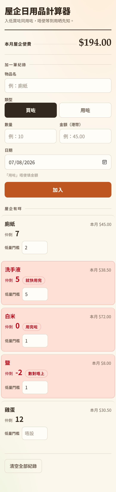

# 屋企日用品計算器 v1

Dot.ai Codex 課程 Level 3 Day 1 堂上砌嘅實物。虛構 client 陳生（四人家庭）想管理屋企日用品：入到「買咗／用咗」、每樣嘢睇到仲剩幾多同本月使咗幾多錢、數量低過門檻會出紅字。

單一 `index.html`，冇外部檔、冇網上 library、冇後端，資料存喺瀏覽器嘅 localStorage。



## 點開

1. 電腦：`index.html` double-click 或者拖入瀏覽器就開到。
2. 電話：將 `index.html` 送去電話開；或者放上 GitHub Pages（main branch 根目錄），用 `https://你個 GitHub 名.github.io/home-supplies/` 開。

紀錄存喺開嗰部機、嗰個瀏覽器、嗰個網址底下。換部機或者換咗個網址開，係空清單，唔係 bug。

## 驗收條件 A1-A9

| # | 條件 |
|---|---|
| **A1** | 可以加一筆紀錄：物品名、買咗／用咗、數量、金額（港幣，「買咗」先要填）、日期 |
| **A2** | 清單區一行一樣物品，見到：名、仲剩幾多、本月喺呢樣嘢使咗幾多錢 |
| **A3** | 「仲剩幾多」由每一筆紀錄計返出嚟，唔准另外儲一個結存數 |
| **A4** | 「本月屋企使費」＝當月所有「買咗」金額加總；「用咗」唔計錢，上個月唔計入 |
| **A5** | 金額用港幣、顯示兩位小數；加總唔准出現浮點尾數（0.1+0.2 要等於 0.30） |
| **A6** | 每樣物品可以設一個低量門檻；仲剩 <= 門檻 → 該行出紅字「就快用完」。A7 嘅邊界規則蓋過呢條（兩條同時中 → 出 A7 嗰句） |
| **A7** | 邊界：剩 0 → 紅字「用完咗」；剩 < 0 → 紅字「數對唔上」且個 app 唔冧；未設門檻 → 任何情況都唔出紅字 |
| **A8** | Refresh／閂 tab 再開，紀錄同門檻都仲喺度；第一次開出「未有紀錄，加第一筆啦」；有「清空全部」掣兼撳之前問一次確定 |
| **A9** | 單一 index.html，唔連外部檔／網上 library；手機 320px 闊用得到；冇登入／帳號、冇貨幣選擇、冇 push notification |

## 自己驗自己

打開個 app，F12 開 Console 打 `selfCheck()`：

```
selfCheck 全過
```

七個 assert 分別驗：買 10 用 3 剩 7、$0.10 + $0.20 = $0.30、上個月嗰筆唔計入本月使費，同埋四個紅字邊界（啱啱等於門檻、剩 0、剩負數、未設門檻）。

## 唔會做嘅嘢

登入／帳號、貨幣選擇、push notification。呢三樣係 client 剔走咗，唔係漏咗。
